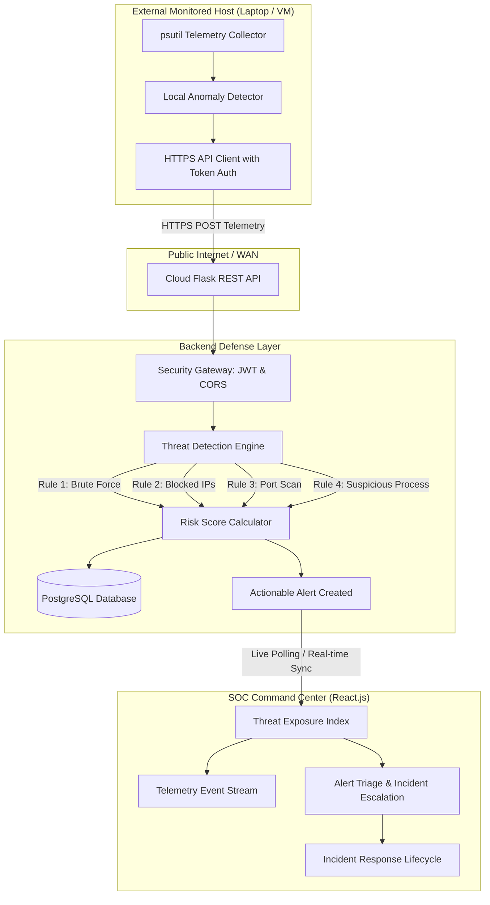

# Real-Time Cybersecurity Threat Monitoring and Incident Response System

[](https://python.org)
[](https://flask.palletsprojects.com/)
[](https://react.dev/)
[](https://postgresql.org)
[]()

> **B.Sc Computer Science with Cyber Security (Year 2 Final Evaluation Project)**  
> Engineered for **Live Cloud Deployment** and cross-network external device telemetry.

---

## 🌟 Executive Summary

This project delivers an enterprise-grade **Security Operations Center (SOC)** platform that ingests real-time security events and telemetry from external devices over the internet, correlates them using a **Threat Detection & Risk Scoring Engine**, stores audit logs in a relational database, generates actionable security alerts, and visualizes them on a live React SOC dashboard with incident response ticketing.



---

## 🚀 Key Features

### 1. External Device Integration (Python Security Agent)
- Runs autonomously on an external laptop, VM, or workstation.
- Continuous heartbeat sensor (updates status to **ONLINE** on the dashboard).
- Network socket monitoring (detects anomalous ports).
- Process inventory scanner (flags offensive tools like `mimikatz.exe`, `netcat`, `nmap`).
- Built-in safe simulation suite (`simulate_events.py`) for live viva demonstrations.

### 2. Threat Detection & Risk Scoring Engine
- **Brute Force Detection:** Triggers `HIGH` severity alert (Risk Score: 8) when >5 failed logins occur from the same IP within 5 minutes.
- **Perimeter Blacklist Matching:** Immediate `CRITICAL` severity alert (Risk Score: 10) upon communication with known malicious IPs.
- **Port Scan Reconnaissance:** Correlates multiple targeted destination ports into a `HIGH` severity alert.
- **Abnormal Login Sequence:** Flags repeated failed attempts followed immediately by a successful login.
- **Dynamic Multi-Factor Risk Score (1 to 10 scale):** Normalizes severity into Low (1–3), Medium (4–6), High (7–8), and Critical (9–10).

### 3. Incident Response (IR) Management
- 1-click escalation from Alert to official Incident Ticket (`INC-2026-XXXX`).
- Full lifecycle status tracking: `OPEN` → `INVESTIGATING` → `CONTAINED` → `RESOLVED`.
- Lead analyst assignment and forensic resolution notes documentation.

### 4. Security Hardening
- **Password Security:** Salted PBKDF2/SHA-256 password hashing via Werkzeug.
- **JWT Authentication:** Cryptographic HMAC-SHA256 tokens with 12-hour expiration.
- **Zero-Trust Input Verification:** Client-supplied severities are never trusted; recalculated on the server.
- **Hardened HTTP Headers:** Injects `X-Frame-Options: DENY`, `X-Content-Type-Options: nosniff`, and `Strict-Transport-Security`.
- **Role-Based Access Control (RBAC):** Distinct permissions for `Admin`, `Security Analyst`, and `User`.

---

## 📁 Repository Structure

```text
cyber-threat-monitoring-system/
├── backend/                  # Flask REST API & Detection Engine
│   ├── app.py                # WSGI entry point, CORS & blueprints
│   ├── config.py             # Dev & Cloud configuration
│   ├── models.py             # SQLAlchemy models (PostgreSQL)
│   ├── detection_engine.py   # 6 Defensive threat detection rules
│   ├── middleware.py         # JWT, RBAC & Device authentication
│   ├── seed.py               # Database demo seed script
│   ├── swagger.py            # OpenAPI 3.0 & interactive Swagger UI
│   ├── requirements.txt      # Python dependencies
│   ├── Dockerfile            # Container definition
│   └── routes/               # Modular REST endpoints
├── frontend/                 # React.js Vite SOC Dashboard
│   ├── src/                  # React source components & pages
│   ├── dist/                 # Pre-bundled standalone distribution
│   ├── package.json          # Vite package dependencies
│   ├── vite.config.js        # Vite build & proxy settings
│   └── vercel.json           # Vercel deployment configuration
├── security-agent/           # External Monitoring Agent
│   ├── agent.py              # Continuous monitoring daemon
│   ├── collector.py          # System & network telemetry collector
│   ├── detector.py           # Local signature anomaly detector
│   ├── api_client.py         # HTTPS client with retry logic
│   ├── simulate_events.py    # Safe college viva event simulator
│   └── requirements.txt      # Agent dependencies
├── database/                 # SQL DDL & Seed scripts
│   ├── schema.sql            # PostgreSQL relational schema
│   └── seed_demo.sql         # Starter demo datasets
├── docs/                     # Academic Documentation
│   ├── COLLEGE_REPORT.md     # Complete project report structure
│   ├── PRESENTATION_PPT.md   # 10-Slide PPT script & viva Q&A
│   ├── DEPLOYMENT_GUIDE.md   # Free-tier cloud deployment guide
│   ├── DEMO_SCENARIO_GUIDE.md# Step-by-step presentation script
│   └── POSTMAN_COLLECTION.json# Full API testing collection
├── docker-compose.yml        # Full-stack container orchestration
├── render.yaml               # 1-click cloud deployment blueprint
├── .gitignore                # Protects secrets and cache
└── README.md                 # Project documentation
```

---

## ⚡ Quick Start (Local Run)

### 1. Start the Backend API & Database
```bash
# Navigate to backend
cd backend

# Install dependencies
pip install -r requirements.txt

# Run the Flask server (initializes SQLite or PostgreSQL and seeds demo data)
python app.py
```
Backend runs at: `http://localhost:5000`  
Interactive Swagger API documentation: `http://localhost:5000/api/docs`  
Web SOC Dashboard: `http://localhost:5000`

### 2. Default Demo Accounts
| Role | Username | Password | Access Level |
|:---|:---|:---|:---|
| **Admin** | `admin` | `AdminSecure2026!` | Full administrative control |
| **Security Analyst** | `analyst1` | `AnalystPass2026!` | Dashboard, alerts triage, incident response |
| **Auditor / User** | `auditor` | `AuditorPass2026!` | Read-only observation |

---

## 🎯 Safe Live Viva Demonstration

On your external laptop, virtual machine, or terminal:

```bash
cd security-agent
python simulate_events.py
```

Choose **Option 1 (Brute Force)**:
1. Dispatches 6 simulated failed logins from IP `203.0.113.88`.
2. The Detection Engine catches attempt #5 and calculates **Risk Score 8/10 (HIGH)**.
3. The live Dashboard instantly displays: **`Brute Force Attack Detected`**.
4. Click **⚡ Escalate →** on the dashboard to convert the alert into an official Incident ticket!

---

## ☁️ Cloud Deployment (Free Tier)

See [`docs/DEPLOYMENT_GUIDE.md`](file:///l:/L%20-%205/docs/DEPLOYMENT_GUIDE.md) for step-by-step instructions:
- **Backend & Database:** 1-Click deploy via Render Blueprint ([`render.yaml`](file:///l:/L%20-%205/render.yaml))
- **Frontend:** Vercel 1-click deploy from GitHub repository.

---

## 📜 Academic Evaluation Documents
- 📄 [Complete College Project Report](file:///l:/L%20-%205/docs/COLLEGE_REPORT.md)
- 📊 [10-Slide PPT Script & Viva Q&A](file:///l:/L%20-%205/docs/PRESENTATION_PPT.md)
- 🚀 [Viva Step-by-Step Demo Script](file:///l:/L%20-%205/docs/DEMO_SCENARIO_GUIDE.md)
- 📮 [Postman Collection](file:///l:/L%20-%205/docs/POSTMAN_COLLECTION.json)
